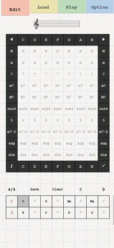
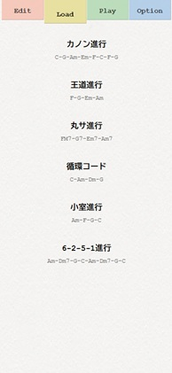
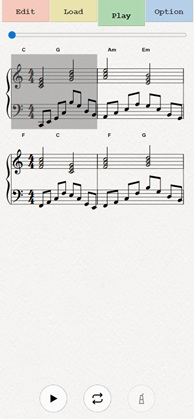
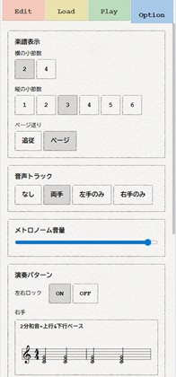
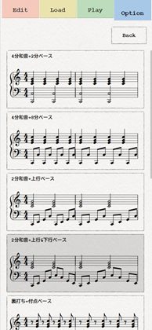

# PiaChord

PiaChord は、モバイルファーストのピアノ用コード進行学習アプリです。  
コード進行をグリッドで編集し、譜面（VexFlow）で確認しながら、伴奏パターン付きで再生できます。

- 公開URL: https://gajumaru314159.github.io/PiaChord/
- 仕様書: `doc/spec.md`

## 主な機能

- Edit / Load / Play / Option のタブ型 UI
- 1セル=1拍のコード入力（8セル単位で自動拡張）
- 3/4・4/4 切り替え、半音移調（♯/♭）、Simile入力（𝄍）
- 楽譜表示と再生（ループ、メトロノーム、左右パターン）
- システム進行 + ユーザー保存進行の管理
- 自動保存（5秒ごと + Editタブ離脱時）
- 言語切り替え（日本語 / English / 中文）
- データ移行（LocalStorage のエクスポート / インポート）

## 使い方

### 1. 起動

1. 公開URLを開きます。
2. スプラッシュ表示（約2秒）後に自動遷移します。
3. `lastOpened` がある場合は Play、ない場合は Load に遷移します。

### 2. Editタブでコード進行を作る

1. 上段の `◀ / ▶` でキーを切り替えます。
2. マトリクスのコード品質とルートをタップして入力します。
3. 必要に応じて `𝄽`（休符）や `𝄍`（Simile）を使います。
4. `Save` で名前付き保存、`Clear` で全消去、`♯/♭` で移調できます。
5. `3/4` と `4/4` を切り替えて拍子を変更できます。

### 3. Loadタブで進行を選ぶ

1. システム進行またはユーザー進行を選択してロードします。
2. ユーザー進行のみ削除（`×`）できます。
3. ロード後は自動的に Play タブへ遷移します。

### 4. Playタブで再生する

1. シークバーで再生位置を移動します。
2. 再生ボタンで開始/停止します。
3. ループ、メトロノームを必要に応じて ON/OFF します。
4. Optionで選んだ左右パターン・テンポで再生されます。

### 5. Optionタブで調整する

- 楽譜表示（横小節数、縦段数、ページ送り）
- 音声トラック（両手 / 左手 / 右手 / なし）
- 演奏パターン（左右ロック、左手/右手の個別選択）
- テンポ（数値入力 + タップ測定）
- 言語切り替え（ja/en/zh）
- データ移行（エクスポート/インポート）

## スクリーンショット

### スプラッシュと初期遷移


### Editタブ（マトリクス入力とコードグリッド）



### Loadタブ（プリセット一覧）



### Playタブ（楽譜 + 再生コントロール）



### Optionタブ（パターン・テンポ・言語設定）




## 開発環境

### 必要要件

- Node.js 20 以上推奨
- npm

### セットアップ

```bash
npm install
```

### 開発コマンド

- `npm run dev` 開発サーバー起動
- `npm run build` 本番ビルド
- `npm run start` 本番サーバー起動
- `npm run lint` ESLint 実行

## 技術スタック

- Next.js 16（App Router）
- React 19
- TypeScript（strict）
- Tailwind CSS v4（`@tailwindcss/postcss`）
- VexFlow 5
- Tone.js 15

## データ保存（LocalStorage）

- `piachord.progression.autosave`
- `piachord.progression.userPresets`
- `piachord.options.current`
- `piachord.progression.lastOpened`

## ディレクトリ概要（`src/`）

- `app/` App Router エントリ
- `components/` 各タブとUI部品
- `context/` `AppContext`（`useReducer` 状態管理）
- `lib/` 音楽ロジック・再生・永続化・翻訳・プリセット
- `types/` ドメイン型定義
