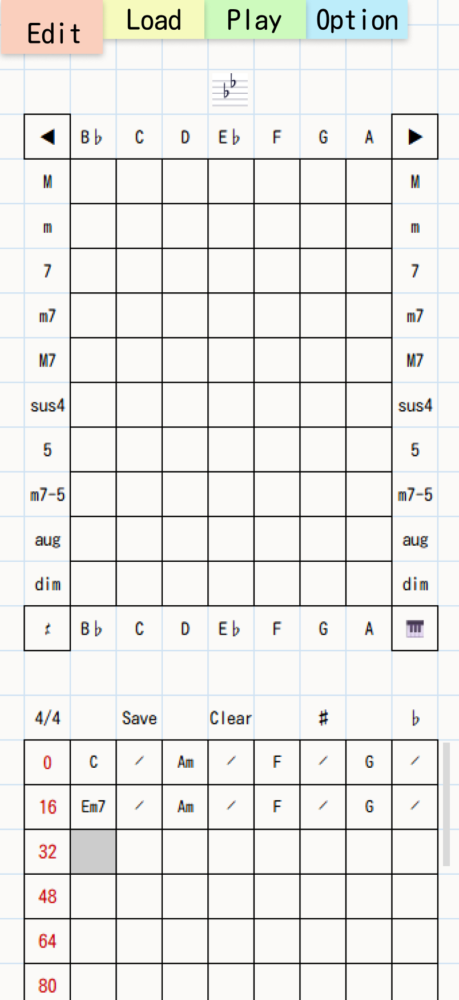
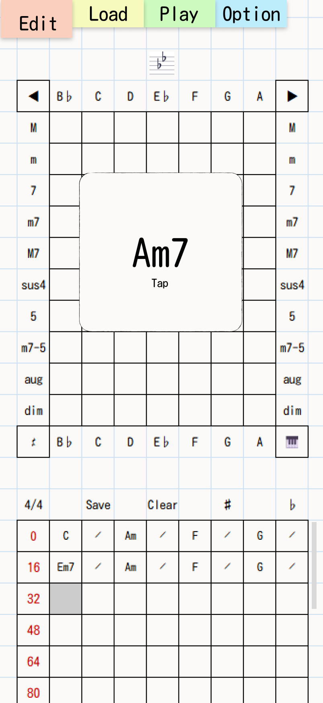
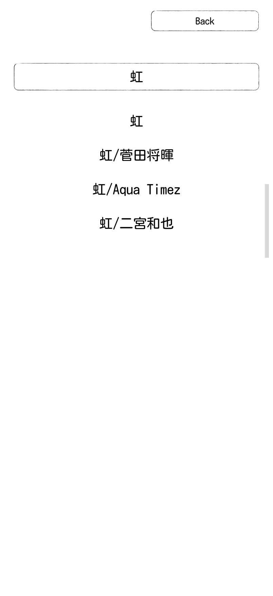
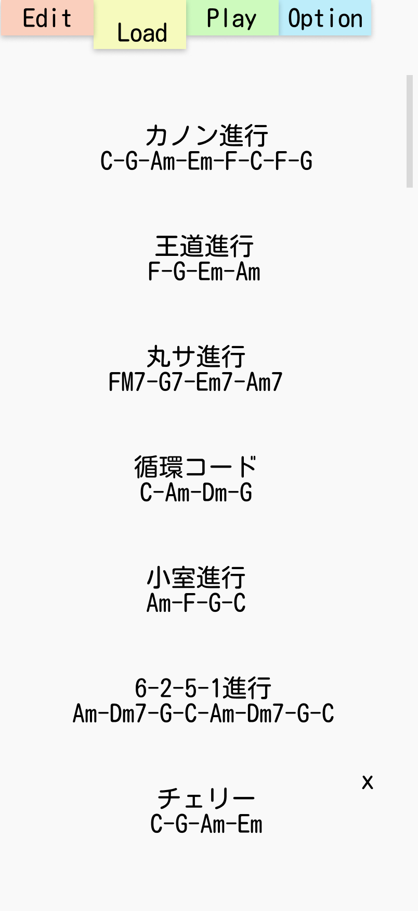
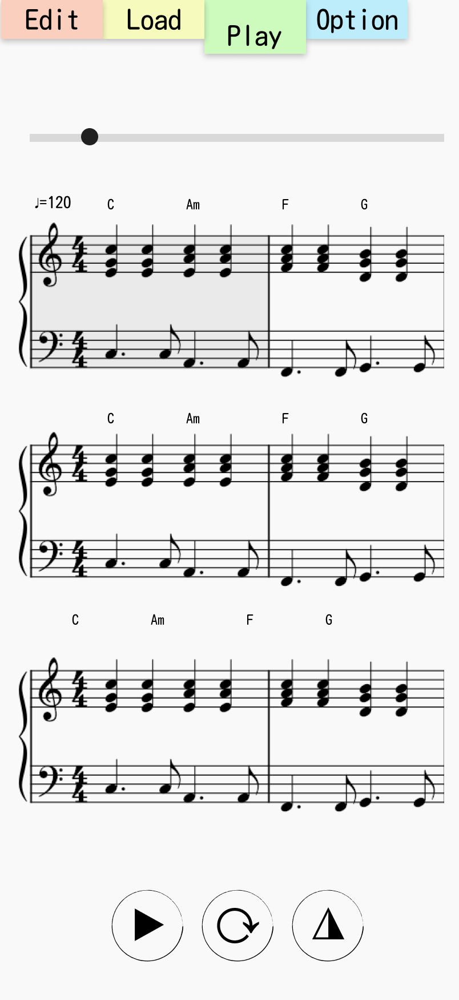
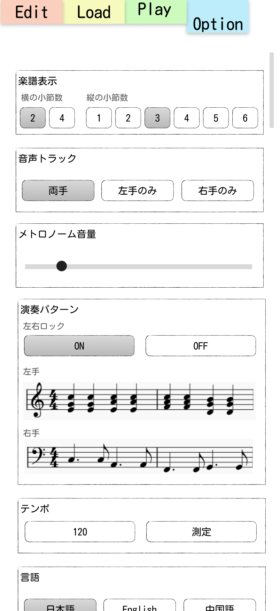
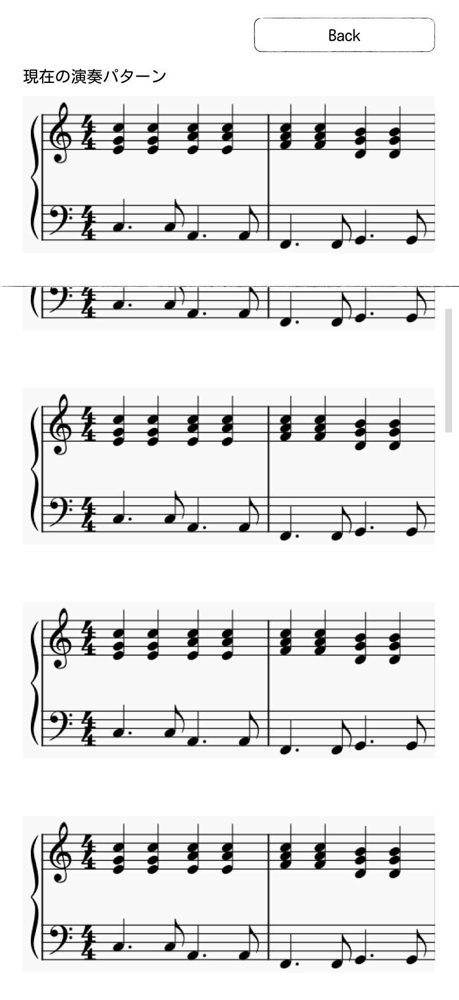

# 目的

ピアノ学習者が、コード進行と伴奏パターンを視覚的・聴覚的に学習できるモバイル優先アプリケーションを提供する。楽譜表示と音声再生を組み合わせ、練習の反復と理解を支援する。

### テスト観点

- コード入力から再生まで、1画面内で完結する導線になっていること
- 初心者が初回起動から30秒以内に再生開始できること

# ターゲットユーザー

- ピアノ初心者から中級者
- コード進行の練習をしたい学習者
- 伴奏パターンのバリエーションを学びたい演奏者

### テスト観点

- 初学者向けの最小操作（入力、保存、再生、テンポ変更）が説明なしで完了できること
- モバイル縦画面で主要操作がファーストビューに収まること

---

# 文書基準

## 用語定義

- コードセル: コード進行パネル上の1マス。1セル=1拍
- 段: コードセル8個で構成される表示単位
- 休符セル: `isRest=true` のセル。画面表示は空白
- ループ長: Playタブで1回の再生対象とするセル数
- 自動保存: 編集中データを `autosave` キーに保存する処理
- 名前付き保存: Save操作で明示的に保存する処理

## 状態遷移の記法

- 記法は `状態A --[イベント/条件]--> 状態B` とする
- 例: `Splash --[2秒経過 && lastOpenedあり]--> Play`
- 再生中断を伴う遷移は必ず `Stop -> 遷移` の順で記述する

## 保存データの命名規則

- LocalStorageキーは `piachord.<domain>.<name>` 形式
- 予約キー:
  - `piachord.progression.autosave`
  - `piachord.progression.userPresets`
  - `piachord.options.current`
  - `piachord.progression.lastOpened`
- 名前付き保存名の予約語は `system.` プレフィックスと重複不可

## エラーハンドリング方針

- ユーザー操作エラーはトーストまたはダイアログで通知し、アプリは継続動作する
- LocalStorage書き込み失敗時はUIに失敗通知し、再試行導線を表示する
- MIDIデバイス未接続時はMIDI入力パネルを無効化し、代替導線（マトリックス入力）を維持する

## アクセシビリティ方針

- タップ対象は最小44px四方を確保する
- 主要ボタンは `aria-label` を必須とする
- 色のみで状態を区別しない（形状またはテキストを併用）

### テスト観点

- 用語が文書内で一意に使われ、同義語の混在がないこと
- 予約キーがすべて仕様内で定義され、未定義キーが存在しないこと

# スプラッシュ画面


## 目的

- 起動直後のアプリ識別と、前回状態への復帰分岐を行う

## 入力

- LocalStorageの `piachord.progression.lastOpened`

## 処理

- アプリ名と作者名を2秒間表示する
- 2秒経過後、以下で遷移する
  - `lastOpened` が存在する: Playタブへ遷移し、対象コード進行をロード
  - `lastOpened` が存在しない: Loadタブへ遷移

## 出力

- 次画面（PlayまたはLoad）

## 保存

- なし

## 例外時挙動

- `lastOpened` が破損している場合は破棄し、Loadタブへ遷移する

## 受け入れ条件

- 表示時間が2.0秒±0.1秒であること
- 条件に応じてPlay/Loadへ正しく分岐すること

### テスト観点

- 正常系: `lastOpened` 有無で遷移先が変わる
- 異常系: JSONパース失敗時でもクラッシュしない

# タブ

## Editタブ





### 目的

- コード進行を高速に入力、編集、保存する

### 入力

- マトリックス入力
  - 横方向は調に合わせた7つのルート候補を表示する
  - 例: B♭調は `B♭, C, D, E♭, F, G, A`
  - `◀` `▶` でキーを切り替える
  - 左下 `𝄽` は休符セルを入力する
  - 右下 `🎹` は装飾要素で、入力動作を持たない
- MIDI入力
  - 同時押しノート集合からコードを推定し、中央候補に表示
  - 転回形は同一コードとして扱う
  - 2音入力時は、マトリックス順（左上から右方向）で最初に一致した候補を採用
  - 1音入力時は、その音をルートにした最小構成コードを候補にする
  - 中央候補をタップすると現在カーソル位置へ確定入力
- ボタン
  - `4/4` ボタン: `4/4` と `3/4` をトグル
  - `Save` ボタン: Saveパネルを開く
  - `Clear` ボタン: 進行全消去（要確認ダイアログ）
  - `♯/♭` ボタン: 進行全体を半音単位で移調

### 処理

- カーソル
  - コード入力で1セル進む
  - セルタップで任意位置へ移動
- 表示
  - 同段で直前拍と同一コードの場合は `𝄍` 表示
  - 休符セルは空白表示
  - カーソル位置はグレー背景
- 拍子表示
  - 内部データは常に8セル単位で保持する
  - `3/4` 時は各段の7拍目・8拍目を非表示にする（内部値は保持）
- 小節番号タップ再生
  - 該当段のみ1回再生
  - 再生中に小節番号以外がタップされた場合、即停止
- 自動保存
  - 5秒ごと、またはEditタブ離脱時に `autosave` へ保存
  - 名前付き保存（Save）は別スロットとして保持
- Saveパネル
  - 上部にBackボタンと名前入力欄を表示
  - 入力中テキストに部分一致する既存名候補を表示
  - 候補タップ時は当該名で保存
  - 予約語および `system.` プレフィックス名は保存不可

### 出力

- 編集済み `Progression`
- Save実行時の `SavedProgression`

### 保存

- 自動保存: `piachord.progression.autosave`
- 名前付き保存: `piachord.progression.userPresets`
- 最終編集対象: `piachord.progression.lastOpened`

### 例外時挙動

- 保存名が不正または空文字の場合は保存せず、入力欄下にエラー表示
- LocalStorage容量不足時は保存失敗を通知し、編集内容はメモリ上で維持

### 受け入れ条件

- マトリックス入力とMIDI入力のどちらでも同一セル仕様に格納されること
- 5秒自動保存とタブ離脱時保存が両方動作すること
- 3/4表示時に7-8拍が非表示で、4/4に戻すと復元されること

### テスト観点

- 入力系: マトリックス/MIDI/休符/移調/クリア
- 保存系: 自動保存、上書き保存、予約語拒否、候補選択
- 表示系: Simile表示、カーソル描画、スクロール挙動

## Loadタブ



### 目的

- システム保存およびユーザー保存のコード進行を選択・削除する

### 入力

- 進行リスト項目タップ
- ユーザー保存項目の `x` ボタンタップ

### 処理

- システム保存とユーザー保存を同一リスト内で表示する
- ユーザー保存のみ削除ボタンを表示する
- 削除時は確認ダイアログを表示し、承認後に削除する
- 件数が多い場合は縦スクロールで表示する

### 出力

- 選択された `Progression` をEdit/Playで利用可能な状態にする

### 保存

- 削除時に `piachord.progression.userPresets` を更新する
- 選択時に `piachord.progression.lastOpened` を更新する

### 例外時挙動

- 削除対象が存在しない場合は何もしない（警告トーストのみ表示）

### 受け入れ条件

- システム保存は削除不可、ユーザー保存は削除可であること
- 削除確認ダイアログ経由でのみ削除されること

### テスト観点

- リスト表示順とスクロール動作
- 選択時ロード、削除時更新、削除キャンセル

## Playタブ



### 目的

- 現在のコード進行を譜面表示と音声で再生する

### 入力

- シークバー操作
- 楽譜の小節タップ
- 再生コントロール（再生/停止、ループ、メトロノーム）

### 処理

- ループ長算出
  - `loopLength = floor(totalCells / beatsPerBar) * beatsPerBar`
  - `totalCells` はEditから受け取った全セル数
  - 4/4例: `CGFCC𝄽𝄽𝄽𝄽` は8セルを1ループとする
  - 3/4例: `CGFCC𝄽𝄽𝄽𝄽` は6セルを1ループとする
- シーク
  - 再生中のシーク操作は `停止 -> 位置変更` の順で処理する
  - シーク後は停止状態を維持する
- 楽譜表示
  - オプションの表示小節数に従ってレンダリングする
  - 小節上部にテンポとコード名を表示する
  - コード未入力セルは空小節として描画する
  - 自動サイズ調整
    - 横2小節: 音符サイズ `0.5x`
    - 横4小節: 音符サイズ `0.25x`
- 再生コントロール
  - `▶/⏸`: 現在小節から再生開始/停止
  - `⟳/→`: ループ再生ON/OFF
  - `◮/△`: メトロノームON/OFF
  - 実装アイコンはSVG等の図形描画を使用する

### 出力

- 再生中小節を示すシーク状態
- 譜面レンダリング結果
- 音声イベント再生

### 保存

- 再生状態は永続化しない
- 最終シーク位置は `piachord.progression.lastOpened` 内のメタ情報として保存可能

### 例外時挙動

- ループ長が0の場合は再生せず、空データメッセージを表示
- 音声再生失敗時は再生を停止し、UI状態を停止に戻す

### 受け入れ条件

- 再生中シーク時に必ず停止してから移動すること
- ループON/OFFが1ループ終了時の挙動に正しく反映されること
- メトロノームON時のみクリック音が鳴ること

### テスト観点

- シークバー操作、楽譜タップシーク、再生中断順序
- ループ境界と末尾休符切り捨ての境界ケース
- コントロール状態と実際の音声状態の一致

## オプションタブ




### 目的

- 譜面表示、再生パート、演奏パターン、テンポ、言語の動作条件を設定する

### 入力

- 楽譜表示設定
  - 横小節数: `2` または `4`
  - 縦段数: `1` から `6`
- 音声トラック選択
- メトロノーム音量スライダー
- 演奏パターン設定
  - 左右ロック（デフォルトON）
  - 左手/右手パターン選択
  - 楽譜タップで演奏パターンパネルを全画面表示
- テンポ設定
  - テキスト入力: 数字のみ、範囲 `30` から `300` BPM
  - 計測入力: 連続タップ間隔の平均値を採用
  - タップ間隔が3秒を超えたら計測をリセット
  - 小数点以下は切り捨て
- 言語設定
  - 翻訳テーブルキーを選択し、UI文言を切り替える

### 処理

- 左右ロックON時は右手変更で左手にも同一パターンIDを適用
- 演奏パターンパネルは非同期で譜面プレビューを描画する
- 演奏パターン一覧は将来追加を前提にスクロール可能とする
- 設定変更は即時にPlay/Edit表示へ反映する

### 出力

- オプション状態
- 演奏パターンプレビューと選択結果

### 保存

- `piachord.options.current` に即時保存する

### 例外時挙動

- 翻訳キー未解決時は既定言語（日本語）にフォールバックする
- 無効なテンポ入力は確定せず、直前有効値に戻す

### 受け入れ条件

- 設定変更が画面遷移なしで反映されること
- テンポ入力が30-300 BPMに正規化されること
- 左右ロックON/OFFでパターン同期仕様が切り替わること

### テスト観点

- 表示小節数と譜面サイズ連動
- 音量スライダーと実効音量
- テンポ計測の平均値算出と3秒リセット
- 言語切り替え時の未翻訳フォールバック

---

# 技術スタック

- React
- Next.js
- Tailwind CSS
- VexFlow（楽譜描画）

補足:

- モバイル優先実装とする
- 外部依存は原則npm管理とし、配信アセットは必要に応じてCDN利用を許容する

## 非機能要件

- 対応端末: iOS/Androidのモダンブラウザ（直近2メジャーバージョン）
- 性能目標: Playタブの譜面切替は200ms以内に初回描画開始
- オフライン前提: 永続化はLocalStorageで完結
- 拡張性: 演奏パターン追加時に既存データ互換性を維持

### テスト観点

- 主要ブラウザでの描画崩れがないこと
- 大量パターン時でもスクロールと選択が実用速度を維持すること

# データ管理

## 型定義（仕様用擬似コード）

```typescript
type PitchClass =
  | "C"
  | "C#"
  | "D"
  | "Eb"
  | "E"
  | "F"
  | "F#"
  | "G"
  | "Ab"
  | "A"
  | "Bb"
  | "B";
type ChordQuality = "M" | "m" | "dim" | "aug" | "sus4" | "7" | "M7" | "m7";
type Hand = "L" | "R";

interface ChordToken {
  root: PitchClass | null; // 休符時はnull
  quality: ChordQuality | null; // 休符時はnull
  tensions: number[]; // 例: [9, 11, 13]
  bass: PitchClass | null; // オンコード
  isRest: boolean;
}

interface Progression {
  beatsPerBar: 3 | 4;
  cells: ChordToken[]; // 1セル=1拍
  cursor: number; // 0-based index
  length: number; // cells.length と同値
}

interface SavedProgression {
  id: string;
  name: string;
  createdAt: string; // ISO8601
  updatedAt: string; // ISO8601
  progression: Progression;
}

interface PlaybackState {
  isPlaying: boolean;
  isLoop: boolean;
  isMetronomeOn: boolean;
  currentBar: number; // 0-based
  tempo: number; // BPM
}

interface PatternRenderRequest {
  progression: Progression;
  startCell: number;
  bars: 2; // 固定2小節単位
  hand: Hand;
  patternId: string;
  tempo: number;
}

interface NoteRender {
  keys: string[]; // 例: ["c/4", "e/4", "g/4"]
  duration: string; // VexFlow duration
}

interface PlaybackEvent {
  atBeat: number;
  midiNotes: number[];
  velocity: number;
  durationBeat: number;
}

interface PatternRenderResult {
  notationMeasures: NoteRender[][]; // 譜面レンダリング用データ
  playbackEvents: PlaybackEvent[]; // 再生用イベント列
}

interface StorageKeys {
  autosave: "piachord.progression.autosave";
  userPresets: "piachord.progression.userPresets";
  options: "piachord.options.current";
  lastOpened: "piachord.progression.lastOpened";
}
```

- コード品質の表記はUI表示と内部実装で同一の `ChordQuality` を使用する（例: `M`, `m`, `M7`）

## 入出力契約（仕様）

```typescript
// MIDIノート集合から入力候補を1つ返す
detectChordFromMidi(notes: number[], keyContext: PitchClass): ChordToken;

// 進行全体を半音単位で移調し、表記優先（sharp/flat）を反映する
transposeProgression(
  progression: Progression,
  semitoneDelta: 1 | -1,
  prefer: "sharp" | "flat"
): Progression;

// 再生ループ長を求める
resolveLoopLength(totalCells: number, beatsPerBar: 3 | 4): number;
```

## 永続化ルール

- `autosave`: 編集中の一時データ（5秒ごと更新）
- `userPresets`: 名前付き保存配列
- `options`: オプション状態
- `lastOpened`: 最後にロードした進行IDと参照情報

### テスト観点

- 型定義と各タブ仕様のフィールド名が一致していること
- ループ長算出と拍子仕様（3/4時の表示制御）が矛盾しないこと
- 譜面レンダリング用データと再生用イベント列が分離されていること

# デザインガイドライン

- 紙をテーマにしたアナログな質感を採用する
- UIモチーフは付箋、鉛筆、紙面テクスチャを中心に構成する
- ベース背景色は `#D9D9D9` を使用する（純白 `#FFFFFF` は使わない）
- 文字色の基準は `#000000` とする
- 操作アイコンは絵文字ではなくSVG等で描画する
- 表示ラベルは「オプション」に統一する

### テスト観点

- コントラスト比が主要操作でWCAG AA相当を満たすこと
- テーマ色が全画面で統一され、例外色が定義外で使用されていないこと
